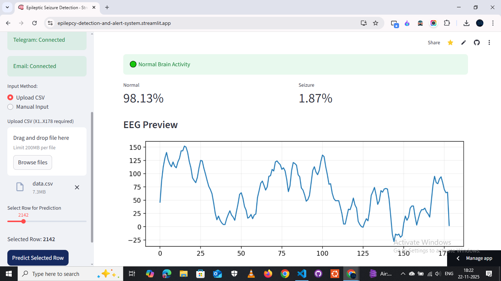
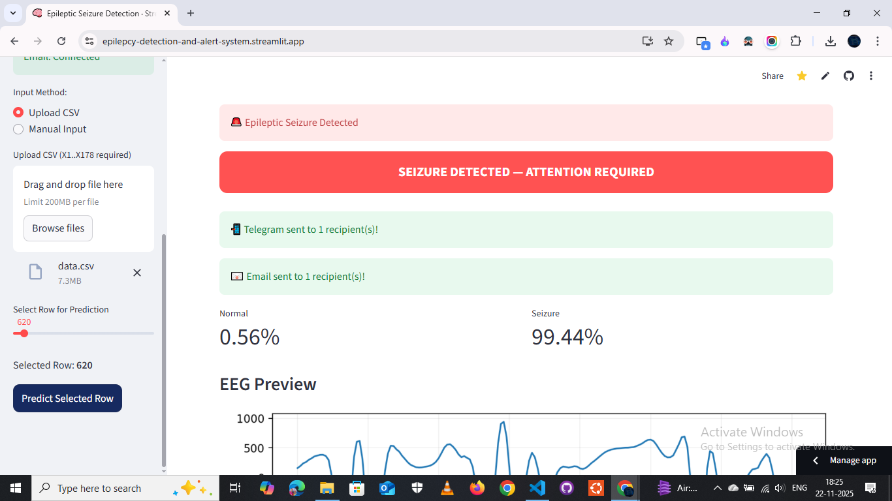
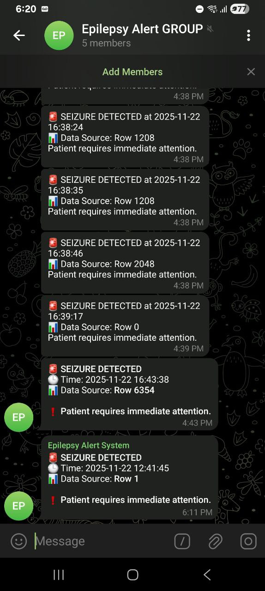
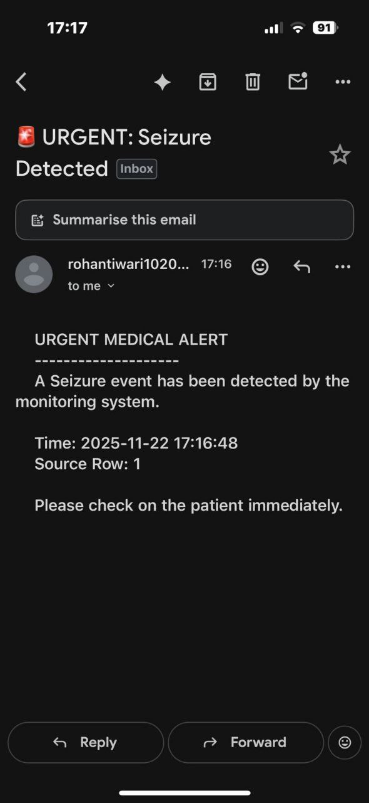
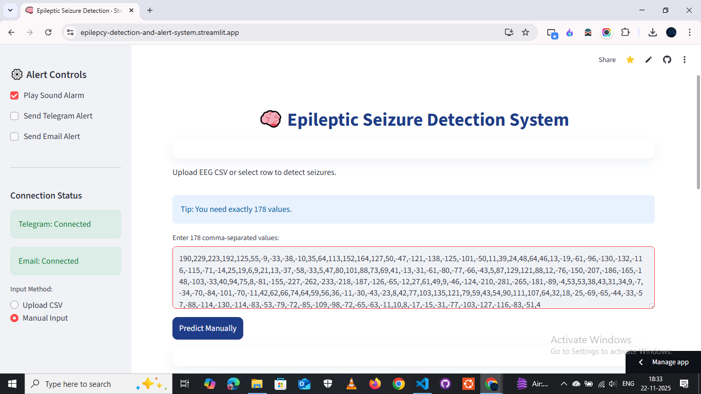

# 🧠 Epileptic Seizure Detection & Alert System

A **real-time Epileptic Seizure Detection System** that analyzes EEG signals using **Machine Learning (Random Forest)** and **Signal Processing (Wavelet Transform)**. When a seizure is detected, the system instantly triggers **multi-channel alerts** via Telegram and Email to caregivers and doctors.

🔗 **Live Demo:** [Launch App](https://epilepcy-detection-and-alert-system.streamlit.app/)
💻 **GitHub Repository:** [Epilepsy Detection System](https://github.com/Rohantiwari10/Epilepcy-Detection-And-Alert-System)

---

## 🚀 Key Features

- **Real-Time Prediction:** Classifies EEG signals as `Seizure` or `Normal` in milliseconds.
- **Advanced Signal Processing:** Uses **Discrete Wavelet Transform (DWT)** and **Hurst Exponent** for feature extraction.
- **Multi-Channel Alerts:**
  - 📱 **Telegram Bot:** Sends instant notifications to a family/doctor group chat.
  - 📧 **Email:** Sends detailed reports to emergency contacts.
  - 🔊 **Sound Alarm:** Plays a loud alert sound locally for immediate attention.
- **Interactive Dashboard:** Built with **Streamlit** for easy data visualization and manual testing.

---

## 📸 Project Screenshots

  
*Main Dashboard & Normal Activity*

  
*Seizure Detected!*

  
*Telegram Alert (Mobile View)*

  
*Email Alert*

  
*Manual Input Testing*

---

## 🛠️ Tech Stack

- **Frontend:** Streamlit
- **Machine Learning:** Scikit-Learn (Random Forest Classifier)
- **Signal Processing:** PyWavelets (Wavelet Transform), Hurst Exponent
- **Alerts:** Python requests (Telegram API), smtplib (Gmail SMTP)
- **Deployment:** Streamlit Community Cloud

---

## ⚙️ Installation & Setup

1. **Clone the Repository**
```bash
git clone https://github.com/Rohantiwari10/Epilepcy-Detection-And-Alert-System.git
cd Epilepcy-Detection-And-Alert-System
```

2. **Install Dependencies**
```bash
pip install -r requirements.txt
```

3. **Configure Secrets (.env)**
```bash
TELEGRAM_BOT_TOKEN="your_telegram_bot_token"
TELEGRAM_CHAT_ID="-100xxxxxxxxxx"  # Your Group ID
EMAIL_SENDER="your_email@gmail.com"
EMAIL_PASSWORD="your_16_digit_app_password"
EMAIL_RECEIVER="doctor_email@gmail.com"
```

4. **Run the App**
```bash
streamlit run app.py
```

---

## 📊 Dataset Details

- **Dataset:** [UCI Epileptic Seizure Recognition Data Set](https://archive.ics.uci.edu/ml/datasets/Epileptic+Seizure+Recognition)
- **Total Rows:** 11,500
- **Columns:** 179 (178 EEG features + 1 Target label)
- **Sampling Rate:** 178 Hz (1 second of recording per row)
- **Classes:**
  - `1` : Seizure Activity (Epileptic)
  - `0` : Normal / Tumor Area / Eyes Closed (Non-Seizure)

---

## 🔮 Future Scope

- Integrate **IoT Headsets** (Emotiv/OpenBCI) for live brainwave streaming.
- Add **GPS Location** to the alert message for emergency ambulances.
- Implement **Deep Learning (LSTM/CNN)** for potentially higher accuracy.

---

## 👨‍💻 Author

**Rohan & Team**  
College Project - 2025

*Disclaimer: This tool is a prototype for educational purposes and should not replace professional medical diagnosis.*